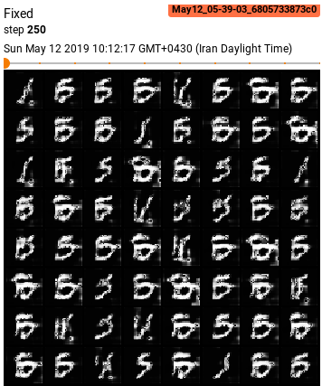
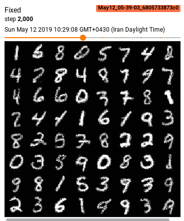
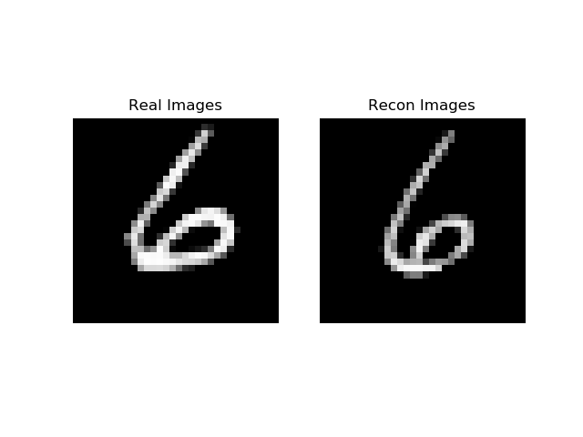
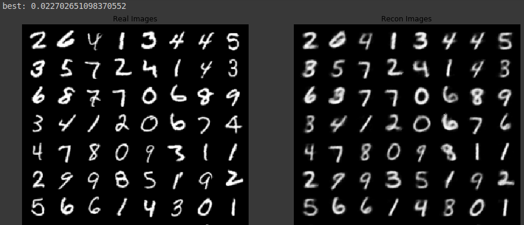
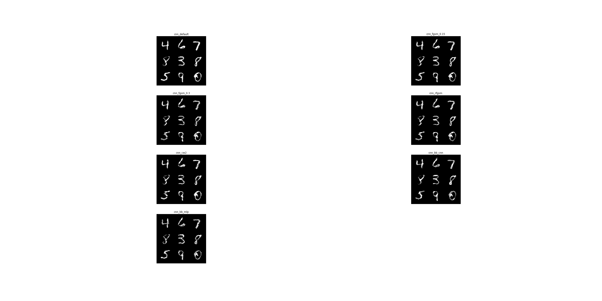

This is an implementation of [Defense-GAN](https://openreview.net/pdf?id=BkJ3ibb0-) as my deep learning assignment for Clova internship.

** How to run **
* train a classifier ``python classifier.py [--mlp] [--adv]``
* attack the trained classifier ``python attacks.py``(it also saves the generated examples for the evaluation phase)
* calculate inception statistics of MNIST ``python fid.py``
* train a GAN on MNIST ``python gan.py``
* train an auto encoder on MNIST ``python autoencoder.py``
* evaluate different defense mechanisms ``python defenses.py``

** Notes **
* it is written in Pytorch 1.1.0 and uses tb-nightly (for the new tensorboard feature in pytorch)
* the DCGAN code is based on [pytorch's example](https://github.com/pytorch/tutorials/blob/master/beginner_source/dcgan_faces_tutorial.py)
* the SNGAN code is based on the [official chainer implementation](https://github.com/pfnet-research/sngan_projection)
* FID calculation code is based on the [the author's officially unofficial PyTorch BigGAN implementation](https://github.com/ajbrock/BigGAN-PyTorch)
        * Note that I use 4096 samples for FID calculation instead of the typical 5000 or 50000
        * due to this sample size, FID of real data is 1.25 instead of 0
        * FID calculation was wrong before commit `fff7a61656eeea9dd89adc9d877bbe70b1a6a91c` I think it's because torch_cov is different from numpy.cov
    * I could not find a good hyper parameter for my GAN, I don't have a GPU and I used colab with the wrong FID calculator(so the founded hyper parameters are not that great)
    * I also implemented a conditional GAN(with conditional batch normalization and projection) to improve the FID(which didn't :/)
* CW2 attack is mostly borrowed from [here](https://github.com/kkew3/pytorch-cw2/)
* the MNIST classifier training loop is also from [pytorch examples](https://github.com/pytorch/examples/blob/master/mnist/main.py)
* I was able to train a good GAN, but I was unable to use it to reconstruct data points well
    * I guess that spectral normalization in the generator can help
    * `L` and `R` parameters of the paper are important
    * also because I don't have a GPU right now I couldn't set L to a larger number and instead found that setting a high R is as good!
    * so it seems that adversarial examples don't have a good representation on the generator's latent manifold and it's enough to just pick a random restart with minimum L2 distance and do not fine-tune the z
* I will upload all the trained models to my google drive and just put some pictures in the repo

** Plots and Samples **
* early samples from the generator

 
	

* final samples from the generator

 
	

* gan reconstruction example

 
	

* autoencoder results

 
	

* attacks on the cnn classifier

 
	

** Defence Results **
* legend: 
	* id defence_method classifier_arch adversarially_trained attack_method: (accuracy_with_defence, without)
defence_methods: 
0 0_cnn_True_0: (0.9918, 0.9918)
1 0_cnn_True_1: (0.9786, 0.9786)
2 0_cnn_True_2: (0.9491, 0.9491)
3 0_cnn_True_3: (0.9618, 0.9618)
4 0_cnn_True_4: (0.9816, 0.9816)
5 0_cnn_True_5: (0.9768, 0.9768)
6 0_cnn_True_6: (0.9829, 0.9829)
7 0_cnn_False_0: (0.989, 0.989)
8 0_cnn_False_1: (0.865, 0.865)
9 0_cnn_False_2: (0.416, 0.416)
10 0_cnn_False_3: (0.583, 0.583)
11 0_cnn_False_4: (0.0, 0.0)
12 0_cnn_False_5: (0.9415, 0.9415)
13 0_cnn_False_6: (0.9679, 0.9679)
14 0_mlp_True_0: (0.9762, 0.9762)
15 0_mlp_True_1: (0.954, 0.954)
16 0_mlp_True_2: (0.9085, 0.9085)
17 0_mlp_True_3: (0.9279, 0.9279)
18 0_mlp_True_4: (0.9725, 0.9725)
19 0_mlp_True_5: (0.9288, 0.9288)
20 0_mlp_True_6: (0.9456, 0.9456)
21 0_mlp_False_0: (0.9754, 0.9754)
22 0_mlp_False_1: (0.2177, 0.2177)
23 0_mlp_False_2: (0.0172, 0.0172)
24 0_mlp_False_3: (0.0399, 0.0399)
25 0_mlp_False_4: (0.0007, 0.0007)
26 0_mlp_False_5: (0.6089, 0.6089)
27 0_mlp_False_6: (0.6692, 0.6692)
28 1_cnn_True_0: (0.9897, 0.9918)
29 1_cnn_True_1: (0.9812, 0.9786)
30 1_cnn_True_2: (0.9674, 0.9491)
31 1_cnn_True_3: (0.9728, 0.9618)
32 1_cnn_True_4: (0.9843, 0.9816)
33 1_cnn_True_5: (0.98, 0.9768)
34 1_cnn_True_6: (0.9832, 0.9829)
35 1_cnn_False_0: (0.9866, 0.989)
36 1_cnn_False_1: (0.9626, 0.865)
37 1_cnn_False_2: (0.9057, 0.416)
38 1_cnn_False_3: (0.9293, 0.583)
39 1_cnn_False_4: (0.9767, 0.0)
40 1_cnn_False_5: (0.9705, 0.9415)
41 1_cnn_False_6: (0.9769, 0.9679)
42 1_mlp_True_0: (0.975, 0.9762)
43 1_mlp_True_1: (0.9641, 0.954)
44 1_mlp_True_2: (0.9476, 0.9085)
45 1_mlp_True_3: (0.954, 0.9279)
46 1_mlp_True_4: (0.9721, 0.9725)
47 1_mlp_True_5: (0.955, 0.9288)
48 1_mlp_True_6: (0.9602, 0.9456)
49 1_mlp_False_0: (0.9669, 0.9754)
50 1_mlp_False_1: (0.8968, 0.2177)
51 1_mlp_False_2: (0.7353, 0.0172)
52 1_mlp_False_3: (0.7954, 0.0399)
53 1_mlp_False_4: (0.9588, 0.0007)
54 1_mlp_False_5: (0.928, 0.6089)
55 1_mlp_False_6: (0.9434, 0.6692)
56 2_cnn_True_0: (0.978, 0.9918)
57 2_cnn_True_1: (0.9489, 0.9786)
58 2_cnn_True_2: (0.8811, 0.9491)
59 2_cnn_True_3: (0.9115, 0.9618)
60 2_cnn_True_4: (0.9369, 0.9816)
61 2_cnn_True_5: (0.9122, 0.9768)
62 2_cnn_True_6: (0.9505, 0.9829)
63 2_cnn_False_0: (0.9619, 0.989)
64 2_cnn_False_1: (0.7717, 0.865)
65 2_cnn_False_2: (0.4486, 0.416)
66 2_cnn_False_3: (0.5685, 0.583)
67 2_cnn_False_4: (0.7161, 0.0)
68 2_cnn_False_5: (0.7851, 0.9415)
69 2_cnn_False_6: (0.902, 0.9679)
70 2_mlp_True_0: (0.9649, 0.9762)
71 2_mlp_True_1: (0.9301, 0.954)
72 2_mlp_True_2: (0.8526, 0.9085)
73 2_mlp_True_3: (0.8841, 0.9279)
74 2_mlp_True_4: (0.9567, 0.9725)
75 2_mlp_True_5: (0.8628, 0.9288)
76 2_mlp_True_6: (0.9111, 0.9456)
77 2_mlp_False_0: (0.9151, 0.9754)
78 2_mlp_False_1: (0.5225, 0.2177)
79 2_mlp_False_2: (0.2294, 0.0172)
80 2_mlp_False_3: (0.2998, 0.0399)
81 2_mlp_False_4: (0.8, 0.0007)
82 2_mlp_False_5: (0.3635, 0.6089)
83 2_mlp_False_6: (0.3647, 0.6692)
84 3_cnn_True_0: (0.8967, 0.9918)
85 3_cnn_True_1: (0.7952, 0.9786)
86 3_cnn_True_2: (0.5702, 0.9491)
87 3_cnn_True_3: (0.6517, 0.9618)
88 3_cnn_True_4: (0.839, 0.9816)
89 3_cnn_True_5: (0.5418, 0.9768)
90 3_cnn_True_6: (0.6092, 0.9829)
91 3_cnn_False_0: (0.8923, 0.989)
92 3_cnn_False_1: (0.7826, 0.865)
93 3_cnn_False_2: (0.5268, 0.416)
94 3_cnn_False_3: (0.6167, 0.583)
95 3_cnn_False_4: (0.8326, 0.0)
96 3_cnn_False_5: (0.5045, 0.9415)
97 3_cnn_False_6: (0.5625, 0.9679)
98 3_mlp_True_0: (0.897, 0.9762)
99 3_mlp_True_1: (0.7636, 0.954)
100 3_mlp_True_2: (0.5268, 0.9085)
101 3_mlp_True_3: (0.6092, 0.9279)
102 3_mlp_True_4: (0.8642, 0.9725)
103 3_mlp_True_5: (0.5829, 0.9288)
104 3_mlp_True_6: (0.632, 0.9456)
105 3_mlp_False_0: (0.8929, 0.9754)
106 3_mlp_False_1: (0.7405, 0.2177)
107 3_mlp_False_2: (0.4628, 0.0172)
108 3_mlp_False_3: (0.5531, 0.0399)
109 3_mlp_False_4: (0.8555, 0.0007)
110 3_mlp_False_5: (0.5474, 0.6089)
111 3_mlp_False_6: (0.6131, 0.6692)
112 4_cnn_True_0: (0.8854, 0.9918)
113 4_cnn_True_1: (0.7768, 0.9786)
114 4_cnn_True_2: (0.5613, 0.9491)
115 4_cnn_True_3: (0.6384, 0.9618)
116 4_cnn_True_4: (0.8294, 0.9816)
117 4_cnn_True_5: (0.5289, 0.9768)
118 4_cnn_True_6: (0.6005, 0.9829)
119 4_cnn_False_0: (0.8808, 0.989)
120 4_cnn_False_1: (0.7703, 0.865)
121 4_cnn_False_2: (0.5508, 0.416)
122 4_cnn_False_3: (0.6289, 0.583)
123 4_cnn_False_4: (0.8242, 0.0)
124 4_cnn_False_5: (0.5213, 0.9415)
125 4_cnn_False_6: (0.587, 0.9679)
126 4_mlp_True_0: (0.8862, 0.9762)
127 4_mlp_True_1: (0.7535, 0.954)
128 4_mlp_True_2: (0.5275, 0.9085)
129 4_mlp_True_3: (0.6063, 0.9279)
130 4_mlp_True_4: (0.852, 0.9725)
131 4_mlp_True_5: (0.58, 0.9288)
132 4_mlp_True_6: (0.6211, 0.9456)
133 4_mlp_False_0: (0.8824, 0.9754)
134 4_mlp_False_1: (0.7456, 0.2177)
135 4_mlp_False_2: (0.524, 0.0172)
136 4_mlp_False_3: (0.6007, 0.0399)
137 4_mlp_False_4: (0.8494, 0.0007)
138 4_mlp_False_5: (0.5708, 0.6089)
139 4_mlp_False_6: (0.6132, 0.6692)
140 5_cnn_True_0: (0.8895, 0.9918)
141 5_cnn_True_1: (0.8757, 0.9786)
142 5_cnn_True_2: (0.8463, 0.9491)
143 5_cnn_True_3: (0.8581, 0.9618)
144 5_cnn_True_4: (0.868, 0.9816)
145 5_cnn_True_5: (0.8342, 0.9768)
146 5_cnn_True_6: (0.8614, 0.9829)
147 5_cnn_False_0: (0.8872, 0.989)
148 5_cnn_False_1: (0.8712, 0.865)
149 5_cnn_False_2: (0.8438, 0.416)
150 5_cnn_False_3: (0.8535, 0.583)
151 5_cnn_False_4: (0.8647, 0.0)
152 5_cnn_False_5: (0.8298, 0.9415)
153 5_cnn_False_6: (0.8545, 0.9679)
154 5_mlp_True_0: (0.8904, 0.9762)
155 5_mlp_True_1: (0.8762, 0.954)
156 5_mlp_True_2: (0.8507, 0.9085)
157 5_mlp_True_3: (0.86, 0.9279)
158 5_mlp_True_4: (0.8825, 0.9725)
159 5_mlp_True_5: (0.8493, 0.9288)
160 5_mlp_True_6: (0.8579, 0.9456)
161 5_mlp_False_0: (0.8875, 0.9754)
162 5_mlp_False_1: (0.8722, 0.2177)
163 5_mlp_False_2: (0.8435, 0.0172)
164 5_mlp_False_3: (0.8557, 0.0399)
165 5_mlp_False_4: (0.8804, 0.0007)
166 5_mlp_False_5: (0.845, 0.6089)
167 5_mlp_False_6: (0.8544, 0.6692)
168 6_cnn_True_0: (0.5499, 0.9918)
169 6_cnn_True_1: (0.5275, 0.9786)
170 6_cnn_True_2: (0.5059, 0.9491)
171 6_cnn_True_3: (0.5097, 0.9618)
172 6_cnn_True_4: (0.5158, 0.9816)
173 6_cnn_True_5: (0.4723, 0.9768)
174 6_cnn_True_6: (0.4905, 0.9829)
175 6_cnn_False_0: (0.5548, 0.989)
176 6_cnn_False_1: (0.5315, 0.865)
177 6_cnn_False_2: (0.4984, 0.416)
178 6_cnn_False_3: (0.5078, 0.583)
179 6_cnn_False_4: (0.5094, 0.0)
180 6_cnn_False_5: (0.4696, 0.9415)
181 6_cnn_False_6: (0.488, 0.9679)
182 6_mlp_True_0: (0.5549, 0.9762)
183 6_mlp_True_1: (0.5377, 0.954)
184 6_mlp_True_2: (0.513, 0.9085)
185 6_mlp_True_3: (0.5166, 0.9279)
186 6_mlp_True_4: (0.5466, 0.9725)
187 6_mlp_True_5: (0.4921, 0.9288)
188 6_mlp_True_6: (0.4936, 0.9456)